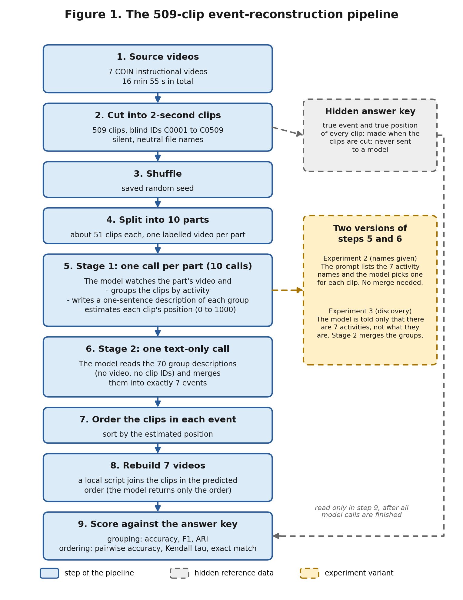

# Fairness-Aware Multimodal Event Reconstruction from Smartphone Media

## Technical Report (interim draft)

**Author:** Sumaya Hashim, SMART Labs
**Supervisor:** Shahzada Muhammad Ali, SMART Labs
**Date:** 21 September 2026
**Status:** Interim draft. Work continues after the supervisor's reply. A PDF version will be made when the project is finished.
**Code repository:** [TO FILL: new repository link] (code only: no photos, videos, clips, answer keys, model runs, or passwords)

---

## Summary

This project asks whether a computer can rebuild an event from a person's phone media. The assigned goal was in three parts: collect photos from a phone onto a laptop, test whether vision models can group and order shuffled video clips into events, and, later, check whether the results differ between groups of people, devices and lighting conditions.

In short, the project:

- built a program that copies photos from an Android phone to a laptop without changing the phone;
- compared four vision models on 21 shuffled clips (7 events, 3 clips each);
- ran a much larger test with 509 shuffled two-second clips from the same seven source videos; and
- repeated that larger test without telling the model what the activities were.

**What is finished**

- The photo collector, with automated tests and a real-phone run.
- A literature review of 12 papers, and a model survey for September 2026.
- The 21-clip comparison of four models, three runs each, with a manual review of all 84 outputs.
- The 509-clip test with the activity names given (staged, 10 parts).
- The 509-clip test without the activity names (event discovery), including a record of every paid call.

**What is not finished, and is not claimed here**

- **No fairness work is covered.** The title includes fairness, but the fairness phase was left out of the assigned scope, and the video data used here (COIN) has no controlled demographic, device or lighting labels. Nothing in this report is a fairness result.
- **No exact reconstruction was achieved.** In the 509-clip tests, none of the seven videos was rebuilt in exactly the right order.
- **Every result is from one dataset of 7 events** and from single runs of the 509-clip tests. Small differences between runs are not evidence of a real effect.
- **The event count was given to the model** in every test. Finding events when their number is also unknown has not been tested.
- **Only one model** (Gemini 3.8 Flash) was used on the 509 clips. Qwen3.8-Max was tried once on one part as a cost test only.
- **The supervisor's answer** on what "combine the videos" should mean (sorting clips into the right video, or exact chronological reconstruction) has not been received. It decides what to improve next.

---

## 1. Goal and assignment history

The project title is "Fairness-Aware Multimodal Event Reconstruction from Smartphone Media". The final goal is to recreate events from a person's smartphone media. It began on 4 September 2026, after the internship letter was issued. The supervisor asked for work on this project to start and for the earlier Islamic-lecture transcription project to be handed to another intern. The deadline he set was 20 September 2026.

The tasks were set in steps:

- **Step 1 (4 to 8 September):** a program that, with a phone connected to the laptop, scans phone storage and copies all photos to the laptop.
- **8 September:** take 20 videos in groups of 3, scramble them, give them to a vision model, and ask the model to build the hierarchy of events. Also make a chart of the latest computer-vision models.
- **10 September:** using an existing dataset instead of recording new videos was confirmed as acceptable.
- **16 September:** cut the videos into 1 or 2 second pieces (200 to 330 clips), scramble them, ask the model to combine them into a video, and check whether the result matches the original.

The fairness phase, meaning comparison across demographic, device and lighting groups, is outside the scope agreed so far.

---

## 2. How the system works

The 509-clip system has nine steps, shown in Figure 1: prepare the clips (steps 1 to 4), two model stages (5 and 6), and a final ordering, rebuilding and scoring stage (7 to 9). The grey box is the hidden answer key, which is used only in step 9. The amber box shows the two versions of steps 5 and 6 that were run (Sections 8 and 9).



*Figure 1. The 509-clip pipeline. The model returns only the clip order; a local script builds the MP4 files.*

The model never sees all 509 clips at once. An attempt to give all 509 clips to a model in one request failed (Section 8), so the work is split into parts. This makes the system a pipeline, not a pure end-to-end test of one model looking at everything.

The photo collector (Section 4) is a separate program and is not part of this pipeline.

---

## 3. Data

**Source.** The videos come from COIN, a large dataset of instructional videos (CVPR 2019). Access to the COIN media was a problem, and a license request was prepared. Seven public source videos were downloaded manually instead. COIN's license terms must be checked before any clips are redistributed, and the videos are not included in the repository.

**The seven activities.** Office chair assembly, guitar string change, French fries preparation, paper pinwheel craft, door knob installation, laptop RAM upgrade, and mango seed planting. They look very different from each other, so telling them apart is easier than it would be for ordinary phone videos.

**The two clip sets.**

| | 21-clip set (Experiment 1) | 509-clip set (Experiment 2) |
|---|---|---|
| Source | Three consecutive annotated steps from each of the 7 videos | The 7 full videos |
| Clips | 21, each 3 to 11 s (mean 5.5 s, about 115 s in total) | 509, each about 2 s |
| Format | Silent, 1280x720, 30 FPS, a visible clip ID | Silent, blind IDs C0001 to C0509 |
| Ground truth | 7 events x 3 ordered clips | 7 events, each with its clips in order |

The seven source videos total 16 minutes 55 seconds. The 509 clips use each video in full, which is above the 200 to 330 clips the supervisor asked for. The 21-clip set uses only a short part of each video.

**Blinding.** Clip IDs are neutral and shuffled, so file names give nothing away. The answer key is kept in separate files that are never sent to a model. Only the scoring script reads it, after all model calls are finished.

---

## 4. Step 1: the photo collector

The collector finds images in the phone's shared storage, copies them to one folder on the laptop, and writes a report. It is in `collect_photos.py` and `src/photo_collector/`, with tests in `tests/`.

What it does:

- detects an Android phone through ADB;
- finds images recursively under `/sdcard`;
- **copies only**: no delete or move operation exists in the code;
- puts all images in one flat folder with collision-safe file names;
- records a SHA-256 hash for each file and flags duplicates;
- writes CSV, JSONL and JSON reports, including each image's original phone path;
- records folders it could not read; and
- has a local-folder mode for testing without a phone.

**Real-phone run (8 September 2026).** It found 20 images and copied all 20 (60,864,975 bytes, about 58 MB) with no failures and no duplicates. Two folders belonging to other apps returned "Permission denied", and the report records this. The collector can only read what the ADB shell is allowed to see. Modern Android restricts private app folders, so the program does not claim that inaccessible files were collected.

These personal photos are stored in `phone_demo_photos/` and are not shared or committed.

The automated tests are run with `python -m unittest discover -s tests -v`. [TO FILL: number of tests and result from a fresh run]

---

## 5. Literature review and the gap

A targeted review of 12 papers (`video_event_reconstruction/research/LITERATURE_REVIEW.md`) covered procedural and hierarchical video understanding (COIN, CrossTask, Ego4D Goal-Step, HT-Step, Video-Mined Task Graphs), temporal reasoning in video models (Perception Test, TempCompass, TimeChat, VTimeLLM, Video-MME), and fairness evaluation (Casual Conversations, FACET).

Main points:

1. Event reconstruction should be scored as separate abilities: grouping, ordering, labelling. A single overall score would hide which part failed.
2. Relations between steps help. COIN, CrossTask and task-graph work all improve predictions by using them.
3. Current video models are still weak at temporal reasoning. For example, Perception Test reports a human score of 91.4% against 45.8% for the video question-answering models it tested.
4. Audio and text should be tested as separate conditions, not mixed in.
5. Longer video is a separate difficulty.
6. Fairness cannot be concluded from overall accuracy. Casual Conversations and FACET report results by subgroup and by combinations of attributes, which is the method a later fairness phase should follow.

**The gap.** In the reviewed set, no paper tests one general model on all four parts at once: grouping unordered clips into events, ordering within events, writing labels, and comparing across demographic or recording groups.

**Later reading (21 September).** Six more papers on ordering shuffled clips and giving models several videos at once were read for this report: What Happens When (VECTOR/MECoT), Visual Jigsaw, MVU-Eval, CrossVid, CVBench and SAMA/MVX-Bench. A seventh, OmniJigsaw, was read from its abstract only. They were read through a summarising tool, and their numbers should be checked against the papers before being quoted. What they suggest:

- Models rely heavily on common sense about typical event order: in VECTOR, models kept most of their accuracy when frames were shuffled.
- Ordering gets much worse as sequences get longer. Accuracy also falls as the number of videos given at once rises (MVU-Eval, CVBench).
- Those benchmarks give a model between 2 and 13 videos at a time, so 509 clips is much larger than what they test.
- Sending videos separately beat joining them into one video in MVU-Eval (by about 7 points for one model).

Ideas from them that have not been tried here: additional ordering measures such as longest common subsequence, using the matching frames at clip edges or image-similarity tools to help order and group clips, a check step that catches dropped or conflicting clips, and a test on unrelated clips joined together to measure how much ordering comes from common sense.

---

## 6. Model selection

A survey of video-capable models for September 2026 is in `video_event_reconstruction/research/BEST_VIDEO_MODELS_SEPTEMBER_2026.md`. It is a shortlist for this task, not a leaderboard. The first shortlist was Qwen3.8-Max, Gemini 3.1 Pro, Gemini 3.8 Flash, InternVideo3-8B-Instruct and Seed2.1 Pro.

The account balance and access decided the final four, all run through OpenRouter:

| Model | OpenRouter ID | Note |
|---|---|---|
| Qwen3.8-Max | `qwen/qwen3.8-max-0902` | Accepts many separate videos; reasoning cannot be turned off |
| Gemini 3.1 Pro | Gemini 3.1 Pro Preview | One combined video needed (Gemini accepts at most 10 videos per request) |
| Gemini 3.8 Flash | `google/gemini-3.8-flash` | Fast and cheap |
| Seed 2.1 Turbo | Seed 2.1 Turbo | **A substitute** for Seed2.1 Pro, which was not available |

InternVideo3-8B-Instruct was not available on OpenRouter and needs a local GPU, so it was dropped. All models were run on visual input only.

---

## 7. Experiment 1: 21 clips, four models

**Design.** The 21 shuffled clips were given to each model with one fixed prompt and one required JSON format (Section 11.1). Each model ran three times. The model was told there are exactly 7 events of 3 clips each, but not what the activities were. Qwen received the 21 clips as separate videos. Gemini and Seed received one combined, lower-bitrate video because of provider size limits.

**Results.** All four models grouped the clips into the 7 events correctly in every run. Ordering was the difference. "Order accuracy" here is the share of the 7 events whose three clips were put in exactly the right order.

| Model | Grouping F1 | Correct orders per run (of 7) | Mean order accuracy | Stability (SD) | Mean latency | Cost, successful runs |
|---|---:|---|---:|---:|---:|---:|
| Qwen3.8-Max | 1.00 | 6, 6, 6 | 85.71% | 0.00% | 103.11 s | $0.4747 |
| Gemini 3.8 Flash | 1.00 | 5, 5, 5 | 71.43% | 0.00% | 11.57 s | $0.0237 |
| Gemini 3.1 Pro | 1.00 | 4, 5, 5 | 66.67% | 6.73% | 20.53 s | $0.0641 |
| Seed 2.1 Turbo | 1.00 | 2, 3, 1 | 28.57% | 11.66% | 29.80 s | $0.0776 |

**Manual review.** All 84 event outputs (four models, three runs, seven events) were checked against start, middle and end storyboards made from the clips. Each was scored 0 to 2 for the event description and for the ordering evidence.

| Model | Event description | Ordering evidence |
|---|---:|---:|
| Qwen3.8-Max | 92.86% | 92.86% |
| Gemini 3.8 Flash | 92.86% | 78.57% |
| Gemini 3.1 Pro | 92.86% | 76.19% |
| Seed 2.1 Turbo | 92.86% | 57.14% |

The main errors were reversed procedural steps, mostly in chair assembly, door-lock installation and RAM replacement. Gemini repeatedly treated the caster clip as a late chair step and read door-lock installation as taking it apart. Seed often mistook water-soaking for frying.

**Limits.** Qwen got separate videos and the others got one combined video, so part of Qwen's lead may come from the input format. A fair comparison was proposed but not run. The review was done by one person. With only 7 events the results are preliminary. The activities are visually distinct, so perfect grouping should not be expected on more ambiguous phone events. Total spend on this experiment, including two earlier truncated outputs, was $0.8322.

---

## 8. Experiment 2: 509 two-second clips

**All at once (failed).** The first attempt gave all 509 shuffled clips to a model in one request. Gemini rejected the long input. Qwen returned cut-off JSON with invented clip IDs, at a cost of about $0.42. Both are kept as part of the record.

**Staged run with the activity names given (18 September).** The clips were split into 10 parts, and Gemini 3.8 Flash was told the seven activity names. For each clip it chose an activity and estimated its position in that activity.

| Measure | Result |
|---|---:|
| Clips grouped into the correct video | 499 of 509 (98.04%) |
| Pairwise F1 | 0.9643 |
| Adjusted Rand index | 0.9576 |
| Mean pairwise ordering accuracy | 76.63% |
| Mean Kendall tau | 0.5327 |
| Exactly reconstructed events | 0 of 7 |
| Cost | $0.128169 |

Ordering was best for the mango (85.66%), guitar (83.89%) and door knob (82.13%) events and worst for RAM (63.97%) and chair (66.55%). The seven reconstructed videos were made by a local script, because the model returns only a clip order.

**What the measures mean.**

- *Grouping accuracy*: the share of clips placed in the right video.
- *Pairwise F1* and *adjusted Rand index* (ARI): whether pairs of clips were correctly judged "same video" or "different video". 1.0 is perfect.
- *Pairwise ordering accuracy*: for two clips from the same video, whether the earlier one was placed first. 50% would be guessing.
- *Kendall tau*: a related ordering score from -1 (reversed) through 0 (random) to 1 (perfect).
- *Exact reconstruction*: a whole video's clip order exactly right.

**Caveat.** Because the model was given the activity names, this tested sorting clips into known events, not finding the events.

---

## 9. Experiment 3: event discovery on the 509 clips (21 September)

**What was tested.** The same 509 clips and the same 10 parts, but the model was told only that there are exactly 7 activities, not what they are. This is the closest test so far to discovery. The prompts are in Section 11.

**Method.**

1. *Stage 1, one call per part.* The model groups the clips in its part by activity (at most 7 groups), writes a one-sentence description of each group, and estimates each clip's position from 0 to 1000.
2. *Stage 2, one text-only call.* The model receives the 70 group descriptions from all parts, with no clip IDs and no video, and merges them into exactly 7 events.
3. Clips are ordered in each event by the estimated position and scored against the hidden answer key. Predicted events are matched to true events by best overlap, so the event names do not matter.

**Results.**

| Measure | Discovery run (told "7 events") | Names given (18 Sep) |
|---|---:|---:|
| Grouping accuracy (over all 509) | 97.84% (498/509) | 98.04% (499/509) |
| Pairwise F1 | 0.9614 | 0.9643 |
| Adjusted Rand index | 0.9542 | 0.9576 |
| Mean pairwise ordering accuracy | 76.82% | 76.63% |
| Mean Kendall tau | 0.5364 | 0.5327 |
| Exactly reconstructed events | 0 of 7 | 0 of 7 |
| Measured cost | $0.139742 | $0.128169 |

Pairwise ordering accuracy by event, discovery run then names-given run: chair 69.09 / 66.55, guitar 82.49 / 83.89, French fries 75.45 / 74.44, pinwheel 85.22 / 79.80, door knob 72.68 / 82.13, RAM 65.14 / 63.97, mango 87.69 / 85.66 (percent). These come from one run each, so differences of a few points should not be read as a real effect.

**The merge worked without errors.** All 70 groups were placed in the right event, ten groups per event (one from each part). The seven activities look very different, so identifying them was the easy part. The remaining errors are individual clips and fine ordering.

**Misgrouped clips.** Ten clips were grouped wrongly, and one clip was dropped by the model.

| Clip | True event | Placed in |
|---|---|---|
| C0031 | mango seed | door knob |
| C0296 | French fries | mango seed |
| C0298 | mango seed | French fries |
| C0299 | French fries | chair |
| C0300 | chair | mango seed |
| C0301 | mango seed | RAM |
| C0302 | RAM | guitar |
| C0303 | guitar | door knob |
| C0304 | door knob | pinwheel |
| C0305 | pinwheel | RAM |
| C0185 (dropped) | French fries | not assigned |

Nine of the ten misgrouped clips are the same clips the names-given run got wrong. So most of the errors look like properties of those clips, not a result of withholding the names. Nine of the ten sit at IDs C0296 to C0305, the tail of part 6. Two of them, C0031 (0.833 s) and C0296 (1.417 s), are shorter than the usual 2 s. Why part 6's tail fails has not been tested.

**Dropped clip.** In both attempts at part 4 the model left out clip C0185 (the first attempt also left out C0183). The response with 50 of 51 clips was accepted and C0185 was counted as unassigned. For this run only: grouping accuracy counts it as wrong over all 509 clips; pairwise F1 and ARI treat it as unassigned; ordering scores use assigned clips only; and an event that lost a clip cannot be an exact reconstruction. The shared scoring code was not edited. A small extra script reuses it, and on the earlier run it gives the earlier numbers exactly. The earlier run had all 509 clips valid, so this rule makes the comparison slightly less like-for-like.

**Failed and recovered calls.**

- **Part 1, first attempt:** HTTP 402 (the API key's limit was too low for video). It was refused before any processing and was not billed. The limit was changed and the part re-run.
- **Part 4:** failed validation twice (49 of 51, then 50 of 51 clips). No third attempt was made.
- **Part 10:** the model returned all 50 clips, but as a bare list instead of the expected wrapper. The checking code was changed to accept this shape, the saved response was re-validated with no new API call, and parts 1 to 9 were re-validated under the same final rules. The prompt was never changed.
- The checking code was also relaxed before the first paid call to accept whole-number floats as integers, drop empty groups, and default a non-numeric confidence to 0.5. The stricter checks (exact ID set, no duplicates, positions 0 to 1000, exactly 7 merged events, every group assigned) were not changed.

**A single-part test with Qwen3.8-Max (21 September).** To see whether a Qwen comparison on the 509 clips was affordable, Qwen3.8-Max was run once on part 1 with the same prompt. It returned valid JSON but only 49 of the 51 clips (C0019 and C0031 were missing), so it failed the same completeness check. It cost $0.05526, about 4.2 times what Gemini 3.8 Flash cost for the same part ($0.013175). Reasoning cannot be turned off for this model, and reasoning tokens are billed as output: 3,523 of its 4,948 output tokens were reasoning. On the 49 clips both models returned, their groups matched exactly. This is a cost and format check, not a comparison: a full Qwen run on the 509 clips would be expected to cost roughly $0.55 to $0.75 and was not run.

---

## 10. What the scores mean, and the limits

- Grouping and ordering scores compare the model with the hidden answer key, so they are real accuracy against ground truth. This is different from the 21-clip manual review, which was one person's judgement of the model's explanations.
- Every 509-clip result is from a single run at temperature 0, on 7 events. No error bars were computed.
- The model was told the number of events in every test. Finding an unknown number of events is not tested.
- The seven activities look very different from each other, so the near-perfect grouping should not be expected to hold for ordinary phone media.
- Ordering within a video is the main weakness: about three of every four clip pairs are put in the right order, but no whole video was rebuilt exactly.
- The 509-clip system is a pipeline of parts and a merge step, so its results cannot be read as one model looking at all the clips at once.
- Only one person reviewed the 21-clip outputs, and there is no inter-rater agreement.
- The 509-clip result uses one model. Whether ordering is a weakness of Gemini 3.8 Flash or of models in general is not known.
- **No fairness claim can be made.** The COIN data has no controlled demographic annotations.
- The COIN videos are YouTube-hosted, and its license terms must be checked before any clips are shared.

---

## 11. Exact prompts and settings

Text in square brackets is filled in by the program.

### 11.1 Experiment 1 (21 clips)

```
You are given 21 shuffled, silent video clips identified only as V001 through V021.

Your task is to reconstruct the underlying events.

Rules:
1. Create exactly 7 events.
2. Assign exactly 3 clips to each event.
3. Use every clip exactly once. Do not omit or repeat any clip.
4. Within each event, arrange its 3 clips in chronological order.
5. Infer a short, neutral description of the complete event.
6. Base your decisions only on visible evidence in the supplied clips.
7. For each of the two transitions in an event, state the visible change or prerequisite that supports the order.
8. Confidence must be a number from 0.0 to 1.0.
9. Return only JSON that conforms to the supplied schema. Do not add Markdown or explanatory text outside the JSON.

The event IDs in your response are arbitrary labels and do not need to match any hidden reference IDs.
```

### 11.2 Experiment 2, part prompt (activity names given)

```
You are processing part [PART] of 10 from a larger event-reconstruction experiment.

This silent video contains [N] shuffled clips. Every clip lasts approximately two seconds and displays a persistent ID. Classify every visible clip into exactly one of the seven event categories below, then estimate where it belongs in that event's original timeline.

Categories:
- office_chair_assembly: assembling an office chair
- guitar_string_change: changing strings on a guitar
- french_fries_preparation: preparing and cooking French fries
- paper_pinwheel_craft: making a paper pinwheel
- door_knob_installation: installing or replacing a door knob
- laptop_ram_upgrade: upgrading RAM in a laptop
- mango_seed_planting: preparing and planting a mango seed

Required clip IDs in this part:
[LIST OF CLIP IDS]

For source_progress, use an integer from 0 (very beginning of the original event) to 1000 (very end). Use visual state and action progression, not the clip ID or its position in this shuffled part. Consecutive moments should receive nearby but distinguishable progress values. Include every required ID exactly once and do not invent IDs. Return only schema-conforming JSON.
```

### 11.3 Experiment 3, stage 1 (no activity names)

```
You are processing part [PART] of 10 from a larger event-reconstruction experiment.

This silent video contains [N] shuffled clips. Every clip lasts about two seconds and shows a persistent ID. Across ALL 10 parts there are exactly 7 different activities (each clip belongs to one of them). This part may contain clips from some or all of them. You are NOT told what the activities are: work it out from what you see.

Task:
1. Group the clips in this part by the activity being performed. Use at most 7 groups, and put every clip in exactly one group.
2. For each group, write a short, specific description (one sentence: the task, the main objects, the setting).
3. For every clip, estimate source_progress: an integer from 0 (very beginning of that activity) to 1000 (very end), from visual state and action progression, not from the clip ID or its position in this shuffled part. Consecutive moments should get nearby but distinguishable values.

Required clip IDs in this part:
[LIST OF CLIP IDS]

Include every required ID exactly once and do not invent IDs. Return only JSON of this exact shape:
{"groups":[{"group_id":"G1","description":"one sentence","clips":[{"clip_id":"C0001","source_progress":0,"confidence":0.0}]}]}
The example values are placeholders. confidence must be between 0 and 1.
```

### 11.4 Experiment 3, stage 2 (merge, text only)

```
A video experiment contains exactly 7 different activities. Ten separate parts were analysed independently. Each part produced groups of clips with a short text description. The same activity appears under different group IDs in different parts, and the wording differs.

Merge these groups into exactly 7 events, one per real activity. Every group must be assigned to exactly one event.

Groups:
[LIST: group key, clip count, description]

Return only JSON of this exact shape:
{"events":[{"event_description":"short description of the activity","group_keys":["p01_G1","p02_G3"]}]}
```

### 11.5 Settings

| Setting | Value |
|---|---|
| Model for Experiments 2 and 3 | `google/gemini-3.8-flash`, through OpenRouter |
| Temperature | 0 |
| Reasoning effort | low, reasoning text excluded from the output |
| Output format | JSON mode, checked locally afterwards |
| Clips per part | about 51 (10 parts) |
| Input to each call | one silent shard video with visible clip IDs |
| Maximum output tokens per part | 5,000 (12,000 for the Qwen test) |
| Retries | none automatic; one manual retry allowed for part 4 |

---

## 12. Where things stand now

### 12.1 Finished

| Item | Result |
|---|---|
| Photo collector | Built, tested, and run on a real phone: 20 of 20 photos copied |
| Literature review | 12 papers, plus later reading on multi-video and ordering |
| Model survey | September 2026 shortlist and chart |
| Experiment 1 | 21 clips, 4 models, 3 runs each, with a manual review of all 84 outputs |
| Experiment 2 | 509 clips, activity names given: 98.04% grouping, 76.63% ordering |
| Experiment 3 | 509 clips, no activity names: 97.84% grouping, 76.82% ordering |
| Cost record | Every paid call logged, including failed ones |

### 12.2 Not finished

| Item | State |
|---|---|
| Supervisor's answer on "combine the videos" | Not received |
| Exact chronological reconstruction | 0 of 7 videos exact; no method tried yet beyond model ordering |
| Unknown number of events | Not tested (the count was always given) |
| More than one model on the 509 clips | Only Gemini 3.8 Flash; Qwen was tested on one part for cost only |
| Fair test of input format (separate vs combined video) | Proposed, not run |
| Look at the misgrouped clips | Not done; why part 6's tail fails is untested |
| Fairness phase | Not started; needs a new dataset with controlled groups |
| Second reviewer for the manual review | None |

---

## 13. Planned future work

**13.0 Depends on the supervisor's reply.** If "combine the videos" means sorting clips into the right video, the 509-clip results already answer it (about 98% grouping). If it means exact chronological reconstruction, ordering is the unsolved part and needs new methods.

**13.1 Ideas to improve ordering** (from the reading in Section 5, none tried yet):

1. Add ordering measures such as longest common subsequence, to show partial progress that pairwise accuracy hides.
2. Use the matching frames at clip edges, or image-similarity tools, to help order clips, and report this as a separate condition because it tests something different from vision-model reasoning.
3. Add a check step that catches clips a model drops or places inconsistently.
4. Test ordering on unrelated clips joined together, to measure how much comes from common sense about typical order.
5. Test how much the result changes when the parts are given in a different order.
6. Run the controlled comparison of separate and combined video input.

**13.2 The fairness phase.** It needs a new dataset with matched events that vary one documented factor at a time, such as lighting, camera motion, skin-tone group, age group, clothing, or indoor and outdoor setting. The same metrics would then be reported for every group and for combinations of groups, with sample sizes and uncertainty, following the methods in Casual Conversations and FACET. Nothing in this report should be described as a fairness result.

**13.3 Suggested order for the next steps.**

1. Send the results to the supervisor and get his answer on the meaning of "combine the videos".
2. Set a spending limit on the OpenRouter key again. It currently has none.
3. Look at the ten misgrouped clips and note what they show.
4. Decide, with the supervisor, whether to fund a Qwen run on the 509 clips (about $0.55 to $0.75).
5. Try the ordering ideas in Section 13.1 that fit the answer to step 1.
6. Plan the dataset for the fairness phase.

---

## 14. How to repeat the work

You will need Python 3.11 or newer, Windows PowerShell, FFmpeg, and an OpenRouter key in a local `.env` file. Never commit `.env`.

Offline test of the photo collector (no phone, no cost):

```powershell
python -m unittest discover -s tests -v
python collect_photos.py --local-source "C:\path\to\sample_phone_storage" --output collected_photos
```

The model runs cost money and need the key. Each script does a dry run unless `--execute` is passed. [TO FILL: confirm the exact commands and folder for the prepared shard inputs, from the scripts' READMEs]

```powershell
python scripts/run_discovery_two_second.py            # dry run, prints the cost estimate
python scripts/run_discovery_two_second.py --part 1 --execute
python scripts/run_discovery_two_second.py --execute  # remaining parts, merge, scoring
```

The media, the answer key and the model outputs are not in the repository and must be supplied.

---

## 15. Cost and model settings

Costs are as reported by OpenRouter, treated as US dollars. Failed calls are included, because they cost money and belong in the record.

| Stage | Cost |
|---|---:|
| Experiment 1, all charged attempts (four models, 12 successful runs plus two earlier truncated outputs) | $0.8322 |
| Experiment 2, one-shot attempts that failed | about $0.42 |
| Experiment 2, staged run with names given | $0.1282 |
| Experiment 3, discovery run (including two failed part 4 calls and the failed part 10 call, $0.0367 together) | $0.1397 |
| Qwen3.8-Max, part 1 cost test | $0.0553 |
| **Total of the rows above** | **about $1.58** |

The OpenRouter account had $1.54 of credit left on 21 September 2026. [TO FILL: confirm the figure for the report date.]

---

## Appendix: files mentioned

- `collect_photos.py`, `src/photo_collector/`, `tests/`: the photo collector and its tests
- `video_event_reconstruction/research/LITERATURE_REVIEW.md`: the 12-paper review
- `video_event_reconstruction/research/BEST_VIDEO_MODELS_SEPTEMBER_2026.md`: the model survey
- `video_event_reconstruction/research/outputs/model_benchmark_20260914/`: the 21-clip results, charts and manual review
- `video_event_reconstruction/research/outputs/DISCOVERY_RUN_NOTE_20260921.md`: the run note for Experiment 3
- `video_event_reconstruction/scripts/run_staged_two_second_reconstruction.py`: Experiment 2
- `video_event_reconstruction/scripts/run_discovery_two_second.py` and `score_discovery_with_dropped_clips.py`: Experiment 3
- `video_event_reconstruction/scripts/run_discovery_qwen.py`: the Qwen cost test
- Not in the repository: `.env`, phone photos, videos, clips, the answer key, model runs, and reconstructed videos
