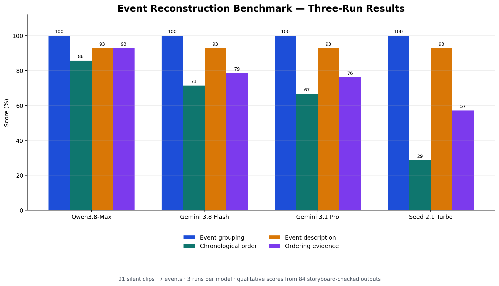

# Three-Run Four-Model Event-Reconstruction Results

Each model completed three successful visual-only trials using the same frozen clips, order, prompt, schema, and model-specific input settings.

| Rank | Model | Grouping F1 | Correct orders per run | Mean order accuracy | Stability (SD) | Mean latency | Total successful cost |
|---:|---|---:|---:|---:|---:|---:|---:|
| 1 | Qwen3.8-Max | 1.00 | 6,6,6 out of 7 | 85.71% | 0.00% | 103.11s | $0.474746 |
| 2 | Gemini 3.8 Flash | 1.00 | 5,5,5 out of 7 | 71.43% | 0.00% | 11.57s | $0.023692 |
| 3 | Gemini 3.1 Pro | 1.00 | 4,5,5 out of 7 | 66.67% | 6.73% | 20.53s | $0.064058 |
| 4 | Seed 2.1 Turbo | 1.00 | 2,3,1 out of 7 | 28.57% | 11.66% | 29.80s | $0.077555 |

All models recovered all seven event groups in every run. Chronological ordering was the meaningful discriminator.

## Event-order consistency

Each cell shows correct repetitions out of three.

| Ground-truth event | Qwen3.8-Max | Gemini 3.1 Pro | Gemini 3.8 Flash | Seed 2.1 Turbo |
|---|---:|---:|---:|---:|
| E01 | 3/3 | 0/3 | 0/3 | 0/3 |
| E02 | 3/3 | 3/3 | 3/3 | 2/3 |
| E03 | 3/3 | 3/3 | 3/3 | 0/3 |
| E04 | 3/3 | 3/3 | 3/3 | 0/3 |
| E05 | 3/3 | 0/3 | 0/3 | 1/3 |
| E06 | 0/3 | 2/3 | 3/3 | 0/3 |
| E07 | 3/3 | 3/3 | 3/3 | 3/3 |

## Cost accounting

- Twelve successful calls: $0.640051225
- All charged attempts, including the two earlier truncated outputs: $0.832185725
- Pre-inference schema and payload rejections cost $0 and remain preserved in the run folders.

## Limitations

- Qwen received 21 separate 720p clips. Gemini and Seed received one lower-bitrate 720p composite due to provider request-size limits.
- Qwen used low reasoning effort, Gemini reported zero reasoning tokens, and Seed required reasoning to be disabled to return an answer.
- Event-description and evidence quality still require blinded manual review.
- The COIN-derived activities are visually distinct, so perfect grouping should not be generalized to more ambiguous smartphone events.

<!-- QUALITATIVE_REVIEW_START -->
## Structured qualitative review

All 84 event outputs (four models × three runs × seven events) were checked against start/middle/end storyboards made from the actual clips.

Scoring rubric:

- **Event description, 2:** correct complete activity and action direction; **1:** correct object/domain but materially incomplete or reversed; **0:** unrelated or incorrect.
- **Ordering evidence, 2:** both adjacent transitions are visibly supported; **1:** one transition is supported or the explanation is only partly consistent; **0:** both are unsupported or materially contradict the clips.

| Model | Event-description score | Ordering-evidence score | Reviewed outputs |
|---|---:|---:|---:|
| Qwen3.8-Max | 92.86% (39/42) | 92.86% (39/42) | 21 |
| Gemini 3.8 Flash | 92.86% (39/42) | 78.57% (33/42) | 21 |
| Gemini 3.1 Pro | 92.86% (39/42) | 76.19% (32/42) | 21 |
| Seed 2.1 Turbo | 92.86% (39/42) | 57.14% (24/42) | 21 |

### Manual findings

- **Qwen3.8-Max:** strongest evidence overall. Its repeated RAM output described only keyboard reinstallation and its evidence partly disagreed with its submitted clip order.
- **Gemini 3.8 Flash:** concise and generally well grounded. It repeatedly treated the caster clip as a late chair step and interpreted door-lock installation as disassembly.
- **Gemini 3.1 Pro:** similar recurring chair and door-lock errors; its first RAM run also placed keyboard reassembly before the memory work.
- **Seed 2.1 Turbo:** event names were usually recognizable, but evidence was substantially weaker. It repeatedly mistook water-soaking for frying and reversed several visible prerequisites.

This is a structured single-reviewer audit, not an independent multi-rater human study. A second blinded reviewer would be required for inter-rater reliability claims.
<!-- QUALITATIVE_REVIEW_END -->
